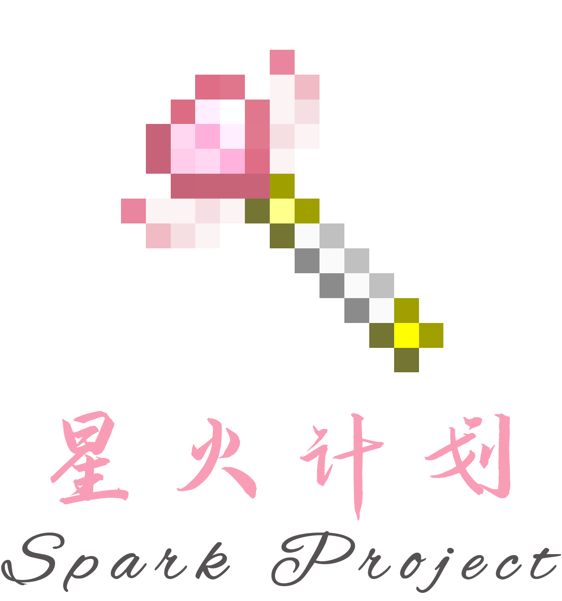

# 星火计划 | Spark Project

## 计划详情

1. 这个夏天, 让我们焕发光彩! 一起加入星火计划 | Spark Project 吧!

2. 星火计划 | Spark Project 是由洛书南 | Losenone 社区全新推出的服务器项目, 由 Yaasasi 企划放出.

3. 本次星火计划大胆采用 Minecraft: Java Edition 1.17 正式版本再加上 1.18 全新数据包的形式进行开放服务器, 让玩家们可以一同抢先体验 1.18 新内容.

## 注意事项

1. 您需要加入星火计划频道, 才可以正式参与星火计划, 否则您无法接收到关于星火计划最新的通知消息, 且无法获得后续星火计划参与奖品.

2. 星火计划最终解释权归 Yaasasi 所有, 如有疑问请提供邮件联系 Yaasasi ([YuXi@yaasasi.cn](mailto:YuXi@yaasasi.cn))

## Spark Project

## 赞助计划

星火计划完全公益运营, 不收取任何费用, 但你仍可以赞助我们, 以保证服务器的正常运营!

o((>ω< ))o[赞助我们](https://afdian.net/@Yaasasi)o((>ω< ))o

## 加入计划

- [计划频道](https://jq.qq.com/?_wv=1027&k=CsRVWdHu)
- [客户端](https://files.yaasasi.cn/SparkProject/Client)
