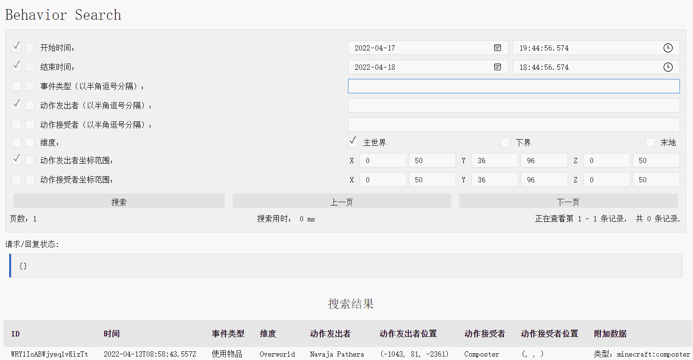
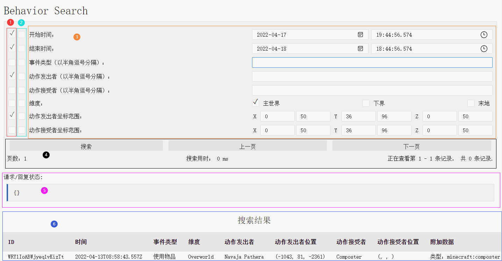

# 玩家行为记录自助查询系统使用指南

## 阅读前须知

1. 玩家行为记录自助查询系统由 [@Nixieboluo](https://github.com/Nixieboluo) 开发, 使用教程由 [@Yaasasi](https://github.com/Yaasasi) 撰写.

2. 玩家行为记录自助查询系统目前仅用于极境之地服务器（洛书南 4th 基岩服务器）, 仅供极境之地玩家查询行为记录使用, 请勿用于破坏、盗窃等不良事件, 请勿外传!

3. 使用 玩家行为记录自助查询系统 请访问 [https://tools.losenone.cn/behavior-search/](https://tools.losenone.cn/behavior-search/) .

## 各模块介绍

1. 请先访问 [玩家行为记录自助查询系统页面](https://my.losenone.cn/auth/register), 打开如下网站即为正确.

   

2. 由上图可见, 玩家行为记录自助查询系统查询页面一共可分为参数区、状态返回区与搜索结果区, 再细化又可以分为 6 个部分, 如下图所示.

   

::: tip
后续将根据上图中的注释序号进行介绍，后续内容请配合上图阅读.
:::

3. ①、② 中各自含有 8 个复选框, 分别平行对应 ③ 中的 8 种参数. 选中 ① 中的的复选框，则搜索行为记录时会通过该复选框对应的参数缩小查询范围. 选中 ③ 中的复选框，则该复选框对应参数的值将被置为 null ( 空白值 ) .

4. ③ 中共有 8 种参数, 分别为开始时间、结束时间、事件类型、动作发出者、动作接收者、维度、动作发出者坐标范围、动作接收者坐标范围.
- 开始时间即字面意思, 查询时间范围的开始. 注意: 开始时间只能为最近 3 天以内 ( 北京时间 UTC/GMT +8.00 ) , 且不能晚于结束时间.
- 结束时间即字面意思, 查询时间范围的开始. 注意: 结束时间必须比当前时间早 1 个小时 ( 北京时间 UTC/GMT +8.00 ) , 且不能早于开始时间.
- 事件类型为玩家行为的分类, 这里列举一些常用的事件类型, 以便使用. "攻击"、"捡起物品"、"丢出物品"、"使用物品"、"放置方块"、"破坏方块"、"打开容器"、"从容器取出物品"、"操作物品展示框"、"方块接受玩家互动".
- 动作发出者即字面意思, 做出一个动作的玩家. 查询时完整填写玩家的 Xbox 经典玩家代号即可, 若不知晓具体玩家请勾选 ② 中所对应的复选框.
- 动作接收者即字面意思, 接收一个动作的玩家. 查询时完整填写玩家的 Xbox 经典玩家代号即可, 若不知晓具体玩家请取消勾选 ① 中所对应的复选框或勾选 ② 中所对应的复选框.
- 动作发出者坐标范围即字面意思. 注意: 设置的 X、Y、Z 的范围必须大于 30 并小于 120 . 查询时所有坐标都会被赋予 [-24, -8] 和 [8, 24] 的随机偏移, 请放心查询.
- 动作接收者坐标范围即字面意思. 注意: 设置的 X、Y、Z 的范围必须大于 30 并小于 120 . 查询时所有坐标都会被赋予 [-24, -8] 和 [8, 24] 的随机偏移, 请放心查询.

5. 填写完成 ③ 中所需的参数后，请点击 ④ 中的 搜索 按钮, ⑤ 中呈现以下结果, 则为搜索成功, 搜索结果将在 ⑥ 呈现, 如需翻页请点击 ④ 中的 上一页 与 下一页 按钮.
```json
{
    "code": 2000,
    "reason": "Request success.",
    "description": "Request success."
}
```

## 常见查询错误

1. 时间范围无效 ( 返回码: 4023 ) , 开始时间不应该早于当前时间 3 天以上.
```json
{
    "code": 4023,
    "reason": "Invalid time range.",
    "description": "Start time should not be X ms earlier than now: 3600000ms",
    "message": "Request failed with status code 400"
}
```

2. 时间范围无效 ( 返回码: 4022 ) , 结束时间应该比当前时间早 1 个小时.
```json
{
    "code": 4022,
    "reason": "Invalid time range.",
    "description": "End time should be X ms earlier than now: 3600000ms",
    "message": "Request failed with status code 400"
}
```

3. 坐标范围无效 ( 返回码: 4031、4032、4033 ) , 坐标范围过小.
```json
{
    "code": 4031,
    "reason": "Invalid location range.",
    "description": "Too narrow: subject x axis",
    "message": "Request failed with status code 400"
}
{
    "code": 4032,
    "reason": "Invalid location range.",
    "description": "Too narrow: subject y axis",
    "message": "Request failed with status code 400"
}
{
    "code": 4033,
    "reason": "Invalid location range.",
    "description": "Too narrow: subject z axis",
    "message": "Request failed with status code 400"
}
```

4. 坐标范围无效 ( 返回码: 4034、4035、4036 ) , 坐标范围过大.
```json
{
    "code": 4034,
    "reason": "Invalid location range.",
    "description": "Too wide: subject x axis",
    "message": "Request failed with status code 400"
}
{
    "code": 4035,
    "reason": "Invalid location range.",
    "description": "Too wide: subject y axis",
    "message": "Request failed with status code 400"
}
{
    "code": 4036,
    "reason": "Invalid location range.",
    "description": "Too wide: subject z axis",
    "message": "Request failed with status code 400"
}
```

5. 请求成功 ( 返回码: 2000 ) , 没有与当前设置的参数相匹配的数据.
```json
{
    "code": 2000,
    "reason": "Request success.",
    "description": "Request success."
}
```