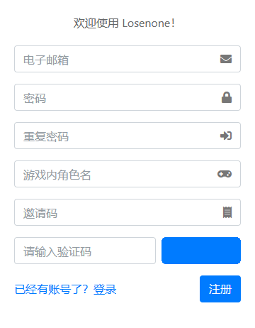
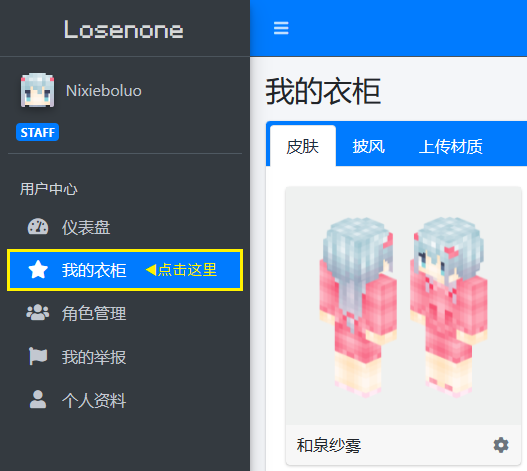
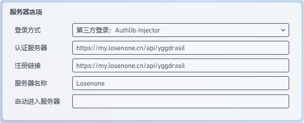
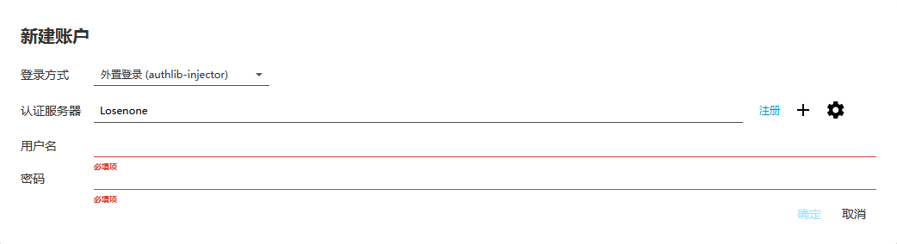

# 社区皮肤站使用指南

## 创建皮肤站账户

1. 请您首先访问我们的 [皮肤站注册网页](https://my.losenone.cn/auth/register), 打开如下网站即为正确.
2. 然后依次填入您的电子邮箱, 密码, 游戏内角色名, 邀请码以及验证码, 然后点击 注册 即可.

    

::: tip
皮肤站邀请码请向 [玖](http://wpa.qq.com/msgrd?v=3&uin=2703877119&site=qq&menu=yes) 获取.
:::

## 配置皮肤站账户

1. 我们需要验证你的电子邮箱地址, 请您打开你的电子邮箱后台, 选择来自 Losenone 的邮件, 点击邮件内的验证链接, 进行验证.
    > 您收到这封邮件，是因为有人在 Losenone 注册时使用了本邮箱地址。
    >
    > **点击此链接验证您的邮箱：`https://my.losenone.cn/auth/verify/1?signature=...`**
    >
    > 如果您并没有访问过我们的网站，或没有进行上述操作，请忽略这封邮件。

2. 当您得到验证成功的提示后, 请返回皮肤站, 然后在侧边栏中选择 "我的衣柜", 你就可以愉快的选择皮肤与披风了!

    

::: tip
皮肤与披风选择完毕后, 不要忘记应用于您的角色哦~
:::

## 登录活动服务器

::: tip
登录活动服务器可使用 Java Edition 与 Bedrock Edition 版本, 请您根据自身情况选择登录方式!

活动服务器连接地址: `bdx.losenone.cn`
:::

### Minecraft: Bedrock Edition

1. 启动游戏后选择服务器.
2. 在最底部点击添加服务器, 输入 `bdx.losenone.cn`, 服务器名称请随意.
3. 点击保存并进入服务器.
4. 进入服务器后选择 `Mojang` 登录.
5. 在登录界面输入您皮肤站帐户与密码即可开始游玩.

### Minecraft: Java Edition

#### PCL2 启动器

1. 启动 PCL2 启动器, 下载 Minecraft: Java Edition 1.17.1 版本.
2. 打开 Minecraft: Java Edition 1.17.1 版本设置, 滑动到最底下的服务器选项, 在登录方式中选择第三方登录, 并按照如下图方式输入内容: `https://my.losenone.cn/api/yggdrasil`.
    
3. 配置完成后返回到启动器主页面, 输入先前注册好的皮肤站帐户与密码, 点击启动游戏即可.
4. 在多人游戏中输入 `bdx.losenone.cn` 保存后, 加入服务器即可.

#### HMCL 启动器

1. 点击账户右侧的 `+`.
2. 登录方式选择 `authlib-injector 登录`.
3. 点击 `管理认证服务器`.
4. 在弹出的窗口内输入 `https://my.losenone.cn/api/yggdrasil` 并点击 "确认".
5. 在 认证服务器 的下拉列表中选中刚刚添加的认证服务器.
6. 填入你的皮肤站账户与密码, 并点击 "确认".
    
7. 配置完成后返回到启动器主页面, 下载 Minecraft: Java Edition 1.17.1 版本, 点击启动游戏即可.
8. 在多人游戏中输入 "bdx.losenone.cn" 保存后, 加入服务器即可.
